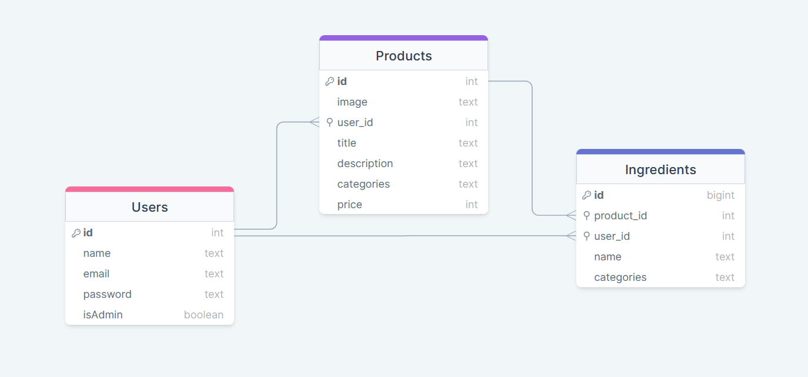

# 💻 About

An API built to receive and return data from the Food Explorer website, which specializes in food industry establishments.

## 🚀 Project configuration

Clone the repository:
Back-end:

```bash
  git clone git@github.com:arks-lacerda/FoodExplorer-BackEnd.git
```

Navigate to the folder:

```bash
  cd FoodExplorer-BackEnd
```

## Environment variables

To run this project, you will need to add the following environment variables to your .env

`API_KEY`

`ANOTHER_API_KEY`

## run the project

To run the program make sure the backend is running, then just run the command:

Back-end:

```bash
  npm run dev
```

## Functionalities 🤖

- Create user;
- Create product;
- Filter products;
- Edit product;
- Delete product:
- View all products;

## Autor

[Arthur Lacerda ](https://github.com/arks-lacerda) 🥇

[ Linkedin ](https://www.linkedin.com/in/arks-lacerda/)

## Deploy 💻

[ Access the FrontEnd here! ](https://github.com/arks-lacerda/FoodExplorer-FrontEnd)
